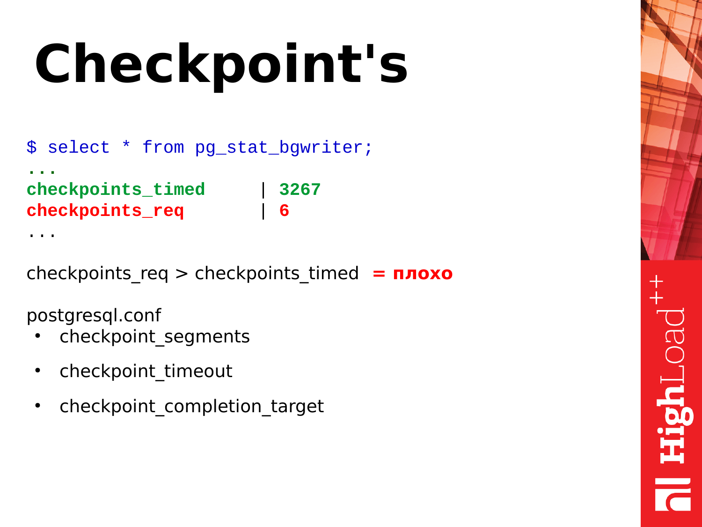
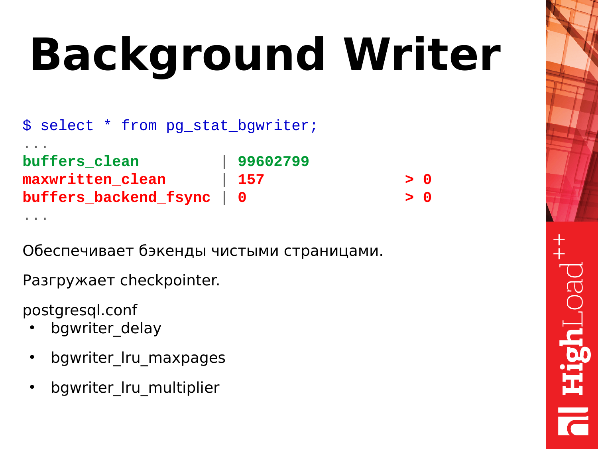

# PostgreSQL. Настройка

!!! Статьи
    - [ ]  [Простое обнаружение проблем производительности в PostgreSQL](https://infostart.ru/1c/articles/1198118/)

## pg_stat_statements
Включение pg_stat_statements

Чтобы включить pg_stat_statements на вашем сервере, измените следующую строку в postgresql.conf и перезапустите PostgreSQL:

``` conf
shared_preload_libraries = 'pg_stat_statements'
```

После загрузки этого модуля на сервер PostgreSQL автоматически начнет собирать информацию. Хорошо то, что накладные расходы модуля действительно очень низкие (накладные расходы в основном просто «шум»).

Затем выполните следующую команду для создания представления, необходимого для доступа к данным:

``` sql
CREATE EXTENSION pg_stat_statements;
```

Расширение создаст представление с именем pg_stat_statements и сделает данные легко доступными.

Самый простой способ найти наиболее интересные запросы — отсортировать вывод pg_stat_statements по total_time:

	
``` sql 
SELECT * FROM pg_stat_statements ORDER BY total_time DESC;
```

Прелесть здесь в том, что тип запроса, который наиболее трудоемкий, естественно будет отображаться в верхней части списка. Лучший способ — пройтись от первого до, скажем, 10-го запроса и посмотреть, что там происходит.

### Углубленный анализ производительности PostgreSQL

pg_stat_statements может предложить гораздо больше, чем просто запрос и время, которое он занял. Вот структура представления:

``` sql 	
test=# \d pg_stat_statements
View "public.pg_stat_statements"
Column               |     Type         | Collation | Nullable | Default
---------------------+------------------+-----------+----------+---------
 userid              | oid              |           |          |
 dbid                | oid              |           |          |
 queryid             | bigint           |           |          |
 query               | text             |           |          |
 calls               | bigint           |           |          |
 total_time          | double precision |           |          |
 min_time            | double precision |           |          |
 max_time            | double precision |           |          |
 mean_time           | double precision |           |          |
 stddev_time         | double precision |           |          |
 rows                | bigint           |           |          |
 shared_blks_hit     | bigint           |           |          |
 shared_blks_read    | bigint           |           |          |
 shared_blks_dirtied | bigint           |           |          |
 shared_blks_written | bigint           |           |          |
 local_blks_hit      | bigint           |           |          |
 local_blks_read     | bigint           |           |          |
 local_blks_dirtied  | bigint           |           |          |
 local_blks_written  | bigint           |           |          |
 temp_blks_read      | bigint           |           |          |
 temp_blks_written   | bigint           |           |          |
 blk_read_time       | double precision |           |          |
 blk_write_time      | double precision |           |          |

``` 

Вполне полезно посмотреть и на столбец **stddev_time**. Если стандартное отклонение велико, можно ожидать, что некоторые из этих запросов будут быстрыми, а некоторые — медленными, что может привести к ухудшению работы пользователей.

Столбец **«rows»** также может быть достаточно информативным. Предположим, что 1000 вызовов вернули 1.000.000.000 строк: фактически это означает, что каждый вызов в среднем возвращал 1 миллион строк. Легко понять, что возвращать столько данных все время не слишком хорошо.

Если требуется проверить, показывает ли определенный тип запроса плохую производительность при кэшировании, будет интересен shared_ *. 
Вкратце: PostgreSQL может сообщить вам частоту обращений к кешу для каждого отдельного типа запроса в случае, если включен **pg_stat_statements**.

Также имеет смысл взглянуть на поля **temp_blks_** *. 
Каждый раз, когда PostgreSQL должен обратиться к диску для сортировки или материализации, потребуются временные блоки.

Наконец-то есть **blk_read_time** и **blk_write_time**. 
Обычно эти поля пусты, если не включен track_io_timing. Идея здесь заключается в том, чтобы иметь возможность измерять количество времени, которое определенный тип запроса тратит на ввод-вывод. Это позволит вам ответить на вопрос, привязана ли ваша система к вводу/выводу или к ЦП. В большинстве случаев рекомендуется включить I/O timing, поскольку это даст вам важную информацию.


### Работа с Java и Hibernate

**pg_stat_statements** дает хорошую информацию. Однако в некоторых случаях запрос может быть прерван из-за переменной конфигурации:

``` sql 
test=# SHOW track_activity_query_size;
track_activity_query_size
---------------------------
1024
(1 row)
``` 

Для большинства приложений 1024 байта абсолютно достаточно. Однако обычно это не тот случай, если вы используете Hibernate или Java. Hibernate имеет тенденцию посылать безумно длинные запросы к базе данных, и поэтому код SQL может быть обрезан задолго до запуска соответствующих частей (например, предложение FROM и т. Д.). Поэтому имеет смысл увеличить **track_activity_query_size** до более высокого значения (возможно 32.786).


### Полезные запросы для выявления узких мест в PostgreSQL

Есть один запрос, который я нашел особенно полезным в этом контексте: Следующий запрос показывает 20 запросов, занимающих много времени:

``` sql 

SELECT substring(query, 1, 50) AS short_query,
              round(total_time::numeric, 2) AS total_time,
              calls,
              round(mean_time::numeric, 2) AS mean,
              round((100 * total_time / sum(total_time::numeric) OVER ())::numeric, 2) AS percentage_cpu
FROM  pg_stat_statements
ORDER BY total_time DESC
LIMIT 20;

```

``` sql 
             short_query                              | total_time | calls | mean | percentage_cpu
----------------------------------------------------+------------+-------+------+----------------
SELECT name FROM (SELECT pg_catalog.lower(name) A   | 11.85      | 7     | 1.69 | 38.63
DROP SCHEMA IF EXISTS performance_check CASCADE;    | 4.49       | 4     | 1.12 | 14.64
CREATE OR REPLACE FUNCTION performance_check.pg_st  | 2.23       | 4     | 0.56 | 7.27
SELECT pg_catalog.quote_ident(c.relname) FROM pg_c  | 1.78       | 2     | 0.89 | 5.81
SELECT a.attname, +                                 | 1.28       | 1     | 1.28 | 4.18
SELECT substring(query, ?, ?) AS short_query,roun   | 1.18       | 3     | 0.39 | 3.86
CREATE OR REPLACE FUNCTION performance_check.pg_st  | 1.17       | 4     | 0.29 | 3.81
SELECT query FROM pg_stat_activity LIMIT ?;         | 1.17       | 2     | 0.59 | 3.82
CREATE SCHEMA performance_check;                    | 1.01       | 4     | 0.25 | 3.30
SELECT pg_catalog.quote_ident(c.relname) FROM pg_c  | 0.92       | 2     | 0.46 | 3.00
SELECT query FROM performance_check.pg_stat_activi  | 0.74       | 1     | 0.74 | 2.43
SELECT * FROM pg_stat_statements ORDER BY total_ti  | 0.56       | 1     | 0.56 | 1.82
SELECT query FROM pg_stat_statements LIMIT ?;       | 0.45       | 4     | 0.11 | 1.45
GRANT EXECUTE ON FUNCTION performance_check.pg_sta  | 0.35       | 4     | 0.09 | 1.13
SELECT query FROM performance_check.pg_stat_statem  | 0.30       | 1     | 0.30 | 0.96
SELECT query FROM performance_check.pg_stat_activi  | 0.22       | 1     | 0.22 | 0.72
GRANT ALL ON SCHEMA performance_check TO schoenig_  | 0.20       | 3     | 0.07 | 0.66
SELECT query FROM performance_check.pg_stat_statem  | 0.20       | 1     | 0.20 | 0.67
GRANT EXECUTE ON FUNCTION performance_check.pg_sta  | 0.19       | 4     | 0.05 | 0.62
SELECT query FROM performance_check.pg_stat_statem  | 0.17       | 1     | 0.17 | 0.56
(20 rows)

``` 

Последний столбец особенно примечателен: он показывает процент общего времени, потраченного на один запрос. Это поможет вам выяснить, насколько влияет запрос на общую производительность или не влияет.


- [x] Первое, что мы можем посмотреть – это процент попадания в кэш. Процент попадания в кэш – это полезная метрика. Она позволяет оценить, какой объем данных берется из кэша shared buffers, а какой объем читается с диска.


Понятное дело, что чем большее у нас попадание в кэш, то тем лучше. Мы оцениваем эту метрику как процент. И, например, если у нас процентное отношение этих попаданий в кэш больше 90 %, то это хорошо. Если оно опускается ниже 90 %, значит, у нас памяти недостаточно для удержания горячей "головы" данных в памяти. И чтобы эти данные использовать, PostgreSQL вынужден обращаться к диску и это медленнее чем если бы данные читались из памяти. И нужно уже думать над увеличением памяти: либо shared buffers увеличивать, либо наращивать железную память (RAM).

``` sql 

select
sum(blks_hit)*100/sum(blks_hit+blks_read) as hit_ratio
from pg_stat_database;

```

### Аномалии

- [x] Что можно еще взять из этого представления? Можно посмотреть аномалии происходящие в базе. Что здесь показано? Здесь есть commits, rollbacks, создание временных файлов, их объем, deadlocks и конфликты.


Мы можем воспользоваться этим запросом. Этот SQL довольно простой. И можем посмотреть вот эти данные у себя.

И здесь сразу пороговые значения. Мы смотрим соотношение commits и rollbacks. Commits – это успешное подтверждение транзакции.

**Rollbacks** – это откат, т. е. транзакция делала какую-то работу, напрягала базу, что-то считала, а потом произошел сбой, и результаты транзакции отбрасываются. Т. е. количество rollbacks, постоянно увеличивающихся, это плохо. И следует как-то избегать их, и править код, чтобы такого не происходило.


**Конфликты (conflicts)** связаны с репликацией. И их тоже следует избегать. Если у вас какие-то запросы, которые выполняются на реплике и возникают конфликты, то нужно эти конфликты разбирать, смотреть, что происходит. Детали можно найти в логах. И устранять конфликтные ситуации, чтобы запросы приложения работали без ошибок.


**Deadlocks** – это тоже плохая ситуация. Когда запросы борются за ресурсы, один запрос обратился к одному ресурсу и взял блокировку, второй запрос обратился ко второму ресурсу и также взял блокировку, а потом оба запроса обратились к ресурсам друг друга и заблокировались в ожидании когда сосед отпустит блокировку. Это тоже проблемная ситуация. Их нужно решать на уровне переписывания приложений и сериализации доступа к ресурсам. И если вы видите, что у вас deadlocks увеличиваются постоянно, нужно смотреть детали в логах, разбирать возникашие ситуации и смотреть в чем проблема.


**Временные файлы (temp_files)** – это тоже плохо. Когда пользовательскому запросу не хватает памяти для размещения оперативных, временных данных, он создает на диске файл. И все операции которые бы он мог выполнить во временном буфере в памяти, начинает выполнять уже на диске. Это медленно. Это увеличивает время выполнения запроса. И клиент, отправивший запрос к PostgreSQL получит ответ чуть позже. Если эти все операции будут выполняться в памяти, Postgres ответит гораздо быстрее и клиент будет меньше ждать.


``` sql 

select datname,
       case
           when (xact_commit + xact_rollback) = 0 then 0
           else
               (xact_commit * 100) / (xact_commit + xact_rollback) end as c_ratio,
       deadlocks,
       conflicts,
       temp_files,
       pg_size_pretty(temp_bytes)                                      as temp_size
from pg_stat_database;

```

**Pg_stat_bgwriter** – это представление описывает работу двух фоновых подсистем PostgreSQL: это checkpointer и background writer.




Для начала разберем контрольные точки, т.н. checkpoints. Что такое контрольные точки? Контрольная точка это позиция в журнале транзакций сообщающая что все изменения данных зафиксированные в журнала успешно синхронизированны с данными на диске. Процесс в зависимости от рабочей нагрузки и настроек может быть длительными и по большей части заключается в синхронизации грязных страниц в shared buffers с датфайлами на диске. Для чего это нужно? Если бы PostgreSQL все время обращался к диску и брал оттуда данные, и записывал данные при каждом обращении, это было бы медленно. Поэтому у PostgreSQL есть сегмент памяти, размер которого зависит от параметров в конфигурации. Postgres размещает в этой памяти оперативные данные для последующей обработки или выдачи по запросам. В случае запросов на изменение данных происходит их изменение. И мы получаем две версии данных. Одна у нас в памяти, другая на диске. И периодически нужно эти данные синхронизировать. Нам нужно то, что изменено в памяти, синхронизировать на диск. Для этого нужны checkpoint.


Checkpoint проходит по shared buffers, помечает грязные страницы, что они нужны для checkpoint. Потом запускает второй проход по shared buffers. И страницы, которые помечены для checkpoint, он их уже синхронизирует. Таким образом выполняется синхронизация данных уже с диском.


Есть два типа контрольных точек. Один checkpoint выполняется по тайм-ауту. Это checkpoint полезный и хороший – checkpoint_timed. И есть checkpoints по требованию – checkpoint required. Такая контрольная точка происходит когда у нас идет очень большая запись данных. Мы записали очень много журналов транзакций. И PostgreSQL считает, что ему нужно все это как можно быстрее синхронизировать, сделать контрольную точку и жить дальше.


И если вы посмотрели статистику pg_stat_bgwriter и увидели, что у вас checkpoint_req гораздо больше, чем checkpoint_timed, то это плохо. Почему плохо? Это значит, что PostgreSQL находится в постоянной стрессовой ситуации, когда ему нужно записывать данные на диск. Checkpoint по таймауту менее стрессовый и выполняется согласно внутреннему расписанию и как бы растянут по времени. У PostgreSQL есть возможность сделать паузы в работе и не напрягать дисковую подсистему. Это для PostgreSQL полезно. И запросы, которые выполняются во время checkpoint не будут испытывать стрессы от того, что дисковая подсистема занята.


И для регулировки checkpoint есть три параметра:

```
сheckpoint_segments.


сheckpoint_timeout.


сheckpoint_competion_target.

```


Они позволяют регулировать работу контрольных точек. Но не буду на них задерживаться. Их влияние – это уже отдельная тема.


Внимание: Рассматриваемая в докладе версия 9.4 уже неактуальна. В современных версиях PostgreSQL параметр checkpoint_segments заменен параметрами min_wal_size и max_wal_size.


- [x] Следующая подсистема это фоновый писатель — **background writer**. Что он делает? Он работает постоянно в бесконечном цикле. Сканирует страницы в shared buffers и странички грязные, которые он нашел, сбрасывает на диск. Таким образом он помогает checkpointer'у делать меньше работы в процессе выполнения контрольных точек.


Для чего он еще нужен? Он обеспечивает потребность в чистых страницах в shared buffers если они вдруг потребуются (в большом количестве и сразу) для размещения данных. Предположим возникла ситуация когда для выполнения запроса потребовались чистые страницы и они уже есть в shared buffers. Постгресовый backend просто берет их и использует, ему не надо самому ничего чистить. Но если вдруг таких страниц нет, бэкенд приостанавливает работу и начинает поиск страниц чтобы сбросить их на диск и взять для своих нужд — что негативно сказывается на времени выполняющегося в данный момент запроса. Если вы видите, что у вас параметр maxwritten_clean большой, это значит, что background writer не справляется со своей работой и нужно увеличивать параметры bgwriter_lru_maxpages, чтобы он смог за один цикл сделать больше работы, больше очистить страничек.


И другой очень полезный показатель – это **buffers_backend_fsync**. Бэкенды не делают fsync, потому что это медленно. Они передают fsync выше по IO stack checkpointer’у. У checkpointer есть своя очередь, он периодически fsync обрабатывает и страницы в памяти синхронизирует с файлами на диске. Если очередь большая у checkpointer и заполнена, то бэкенд вынужден сам делать fsync и это замедляет работу бэкенда, т. е. клиент получит ответ позже, чем мог бы. Если вы видите, что у вас это значение больше нуля, то это уже проблема и нужно обратить внимание на настройки background writer'а и также оценить производительность дисковой подсистемы.





``` sql 

select
relname,
pg_size_pretty(pg_relation_size(relname::regclass)) as size,
seq_scan, seq_tup_read,
seq_scan / seq_tup_read as seq_tup_avg
from pg_stat_user_tables
where seq_tup_read > 0
 order by 3,4
  desc limit 5;


```


Первое, что мы можем посмотреть, это последовательные сканирования по таблице. Само число после этих проходов еще не обязательно плохо и не показатель того, что нам нужно уже что-то предпринимать.


Однако есть вторая метрика – **seq_tup_read**. Это количество строк, возвращенных в результате последовательного сканирования. Если усредненное число превышает 1 000, 10 000, 50 000, 100 000, то это уже показатель, что возможно вам нужно где-то построить индекс, чтобы обращения были по индексу, либо возможно оптимизировать запросы которые использую такие последовательные сканирования, чтобы такого не было.


Простой пример – допустим, запрос с большим OFFSET и LIMIT стоит. К примеру сканируется 100 000 строк в таблице и после этого берется 50 000 нужных строк, а предыдщие отсканированные строки отбрасываются. Это тоже плохой кейс. И такие запросы нужно оптимизировать. И здесь вот такой простой SQL-запрос, на котором можно это посмотреть и оценить полученные цифры.

[Deep dive into PostgreSQL internal statistics. Алексей Лесовский](https://habr.com/ru/post/505440/)


## Полезные запросы

### Базы данных с максимальным IO Postgres

``` sql 

SELECT
pg_stat_database.datname AS DatabaseName,
MAX(pg_stat_database.tup_returned) AS TotalReads,
MAX(pg_stat_database.tup_inserted + pg_stat_database.tup_updated + pg_stat_database.tup_deleted) AS TotalWrites,
MAX(pg_stat_database.tup_returned + pg_stat_database.tup_inserted + pg_stat_database.tup_updated
+ pg_stat_database.tup_deleted) AS IO,
SUM(pg_stat_statements.calls) AS ExecutionCount

FROM
pg_catalog.pg_stat_database AS pg_stat_database
LEFT OUTER JOIN pg_stat_statements AS pg_stat_statements
ON pg_stat_statements.dbid = pg_stat_database.datid
GROUP BY
pg_stat_database.datname
ORDER BY
IO Desc

```

### Размер временных таблиц «1С» в Postgres

``` sql
select relnamespace, sum(relpages::bigint*8192), pg_size_pretty(sum(relpages::bigint*8192))
from pg_class where relname like 'tt%' group by 1 order by 2 desc;
select sum(relpages::bigint*8192), pg_size_pretty(sum(relpages::bigint*8192)) from pg_class where relname like 'tt%';

```

### Транзакции, ожидающие на блокировках Postgres

``` sql

SELECT blocked_locks.pid AS blocked_pid,
blocked_activity.usename AS blocked_user,
blocking_locks.pid AS blocking_pid,
blocking_activity.usename AS blocking_user,
blocked_activity.query AS blocked_statement,
blocking_activity.query AS current_statement_in_blocking_process,
blocked_activity.application_name AS blocked_application,
blocking_activity.application_name AS blocking_application
FROM pg_catalog.pg_locks blocked_locks
JOIN pg_catalog.pg_stat_activity blocked_activity ON blocked_activity.pid = blocked_locks.pid
JOIN pg_catalog.pg_locks blocking_locks
ON blocking_locks.locktype = blocked_locks.locktype
AND blocking_locks.DATABASE IS NOT DISTINCT FROM blocked_locks.DATABASE
AND blocking_locks.relation IS NOT DISTINCT FROM blocked_locks.relation
AND blocking_locks.page IS NOT DISTINCT FROM blocked_locks.page
AND blocking_locks.tuple IS NOT DISTINCT FROM blocked_locks.tuple
AND blocking_locks.virtualxid IS NOT DISTINCT FROM blocked_locks.virtualxid
AND blocking_locks.transactionid IS NOT DISTINCT FROM blocked_locks.transactionid
AND blocking_locks.classid IS NOT DISTINCT FROM blocked_locks.classid
AND blocking_locks.objid IS NOT DISTINCT FROM blocked_locks.objid
AND blocking_locks.objsubid IS NOT DISTINCT FROM blocked_locks.objsubid
AND blocking_locks.pid != blocked_locks.pid
JOIN pg_catalog.pg_stat_activity blocking_activity ON blocking_activity.pid = blocking_locks.pid
WHERE NOT blocked_locks.GRANTED;

```

### Список текущих блокировок в postgres

``` sql 

SELECT
l.mode,
d.datname,
c.relname,
l.granted,
l.transactionid
FROM
pg_locks AS l
LEFT JOIN pg_database AS d ON l.database= d.oid
LEFT JOIN pg_class AS c ON l.relation = c.oid;

```

### Нагрузка, создаваемая запросами Postgres

``` sql

SELECT
pg_database.datname AS Database,
pg_stat_statements.shared_blks_read + pg_stat_statements.shared_blks_written AS Memory,
pg_stat_statements.local_blks_read + pg_stat_statements.local_blks_written AS IO,
pg_stat_statements.temp_blks_read + pg_stat_statements.temp_blks_written AS Temp,
pg_stat_statements.calls AS ExecutionCount,
pg_stat_statements.total_exec_time ExecutionTime,
pg_stat_statements.query AS Query

FROM
pg_stat_statements AS pg_stat_statements
INNER JOIN pg_database AS pg_database
ON pg_database.oid = pg_stat_statements.dbid
ORDER BY
ExecutionTime DESC

```

!!! info "Источники"
    - [x] [Настройка PostgreSQL 11.5 и 1C: Предприятие 8.3.16 на Windows Server 2008R2](https://infostart.ru/1c/articles/1180438/)
    - [x] [Useful DBA tools by Data Egret](https://github.com/dataegret/pg-utils) - usefull sql scripts
    - [x] [infostart. Немного о конфигурировании PostgreSQL](https://infostart.ru/1c/articles/325482/)
    - [x] [infostart. Держи данные в тепле, транзакции в холоде, а VACUUM в голоде](https://infostart.ru/1c/articles/1191667/)
    - [x] [ИТС. Особенности использования PostgreSQL](https://its.1c.ru/db/metod8dev#browse:13:-1:1981:1987)
    - [x] [ИТС. Настройки PostgreSQL для работы с 1С:Предприятием. Часть 2](https://its.1c.ru/db/metod8dev#content:5866:hdoc)
    - [x] [ИТС. Настройки PostgreSQL](https://its.1c.ru/db/metod8dev#browse:13:-1:1989:2599:2600:2604)
    - [x] [Держи данные в тепле, транзакции в холоде, а VACUUM в голоде](https://is1c.ru/career/blog/derzhi-dannye-v-teple-tranzaktsii-v-kholode-a-vacuum-v-golode/)
    - [ ] [Простое обнаружение проблем производительности в PostgreSQL](https://infostart.ru/1c/articles/1198118/)
    - [x] [Работа с PostgreSQL настройка и масштабирование](https://postgresql.leopard.in.ua/) - 
    Перед вами справочное пособие по настройке и масштабированию PostgreSQL. В книге исследуются вопросы по настройке производительности PostgreSQL, репликации и кластеризации. Изобилие реальных примеров позволит как начинающим, так и опытным разработчикам быстро разобраться с особенностями масштабирования PostgreSQL для своих приложений.
    - [x] [PGTune](https://pgtune.leopard.in.ua/) - PGTune calculate configuration for PostgreSQL based on the maximum performance for a given hardware configuration. It isn't a silver bullet for the optimization settings of PostgreSQL. Many settings depend not only on the hardware configuration, but also on the size of the database, the number of clients and the complexity of queries. An optimal configuration of the database can only be made given all these parameters are taken into account.
    - [x] [3 WAYS TO DETECT SLOW QUERIES IN POSTGRESQL](https://www.cybertec-postgresql.com/en/3-ways-to-detect-slow-queries-in-postgresql/)
    - [x] [How to tune PostgreSQL for memory](https://www.enterprisedb.com/postgres-tutorials/how-tune-postgresql-memory)


!!! info "Репозитории"
    - [x] [Скрипты бекапа, восстановления, удаления и обслуживания баз 1С PostgreSQL (Windows)](https://github.com/anklav24/PostgreSQL-Scripts)
    - [x] [pgBadger - a fast PostgreSQL log analysis report](https://github.com/darold/pgbadger)


<details>  
  <summary>Настройка postgresql.conf</summary>

``` 
autovacuum = on
autovacuum_max_workers = Количество равным половине всех ядер сервера СУБД.
autovacuum_vacuum_cost_limit = 1
autovacuum_vacuum_cost_delay = 20ms
autovacuum_vacuum_scale_factor = 0.1 -> 0.01
autovacuum_analyze_scale_factor = 0.2 -> 0.005

```
</details>

!!! info "Описание параметров"

    **shared_buffers** — Количество памяти, выделенной PgSQL для совместного кеша страниц. Эта память разделяется между всеми процессами PgSQL. Делим доступную ОЗУ на 4. В нашем случае это 4 Gb.

    **effective_cache_size** — Оценка размера кэша файловой системы. Считается так: ОЗУ — shared_buffers. В нашем случае это 16Gb — 4Gb = 12Gb. Но рекомендуется указать этот параметр ниже, где-то 8-10Gb.

    **max_connections** = 100  максимальное число клиентских подключений, которые могут подсоединяться к базе данных одновременно.random_page_cost = 1.5 — 2.0 для RAID, 1.1 — 1.3 для SSD. Стоимость чтения рандомной страницы. Чем меньше seek time дисковой системы тем меньше (но > 1.0) должен быть этот параметр. Излишне большое значение параметра увеличивает склонность PgSQL к выбору планов с сканированием всей таблицы.
    
    **temp_buffers** = 512Mb. Максимальное количество страниц для временных таблиц. То есть это верхний лимит размера временных таблиц в каждой сессии (рекомендуемый размер 1/20 RAM).

    **wal_sync_method** = open_datasync.  метод, который используется для принудительной записи данных на диск. open_datasync – запись данных методом open() с параметром O_DSYNC, fdatasync – вызов метода fdatasync() после каждого commit, fsync_writethrough – вызывать fsync() после каждого commit игнорирую паралельные процессы, fsync – вызов fsync() после каждого commit, open_sync – запись данных методом open() с параметром O_SYNC. Наилучший по тесту для Windows считается open_datasync(для Линукс = fdatasync)
    
    **work_mem** — Считается так: ОЗУ / 32..64 — в нашем случае получается 512mb. Лимит памяти для обработки одного запроса. Эта память индивидуальна для каждой сессии. Теоретически, максимально потребная память равна max_connections * work_mem.

    **bgwriter_delay** — 20ms. Время сна между циклами записи на диск фонового процесса записи. Данный процесс ответственен за синхронизацию страниц, расположенных в shared_buffers с диском. Слишком большое значение этого параметра приведет к возрастанию нагрузки на  checkpoint процесс и процессы, обслуживающие сессии (backend). Малое значение приведет к полной загрузке одного из ядер.

    **synchronous_commit** — off. ОПАСНО! Выключение синхронизации с диском в момент коммита. Создает риск потери последних нескольких транзакций (в течении 0.5-1 секунды), но гарантирует целостность базы данных, в цепочке коммитов гарантированно отсутствуют пропуски. Но значительно увеличивает производительность.