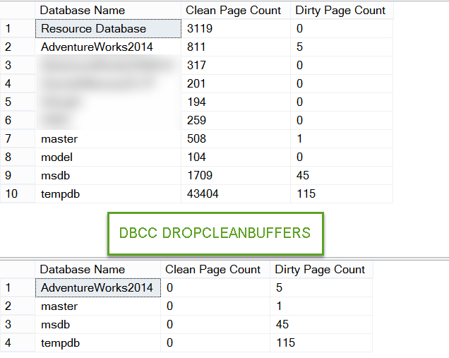
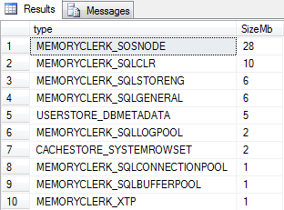

- [MS SQL. Troubleshooting](#ms-sql-troubleshooting)
  - [SQL Server Memory Buffer Pools](#sql-server-memory-buffer-pools)
  - [SQL Server Buffer Pool in action](#sql-server-buffer-pool-in-action)
  - [Troubleshooting the CXPACKET wait type in SQL Server](#troubleshooting-the-cxpacket-wait-type-in-sql-server)
  - [Showplan Operator of the Week – SORT](#showplan-operator-of-the-week--sort)


# MS SQL. Troubleshooting


## SQL Server Memory Buffer Pools

Когда страница изменяется в памяти из-за модификации данных (вставка/обновление/удаление), она называется «грязной» страницей. 

С другой стороны, если страница, которая не изменена, называется «чистой» страницей. 

До SQL 2005 не было простого способа найти информацию о страницах в пуле буферов. Начиная с SQL Server 2005, каждая страница данных в пуле буферов имеет один дескриптор буфера. 

Дескрипторы буфера DMV может однозначно идентифицировать каждую страницу данных, которая в данный момент кэшируется в экземпляре SQL Server в пуле буферов. 

Этот DMV sys.dm_os_buffer_descriptors возвращает кэшированные страницы для всех пользовательских и системных баз данных. 

Сюда входят страницы, связанные с базой данных ресурсов, которая является скрытой системной базой данных.

<details>
    <summary>Cколько страниц чистого и грязного типа для каждой базы данных.</summary>

``` sql 

SELECT (CASE 
           WHEN ( [database_id] = 32767 ) THEN 'Resource Database' 
           ELSE Db_name (database_id) 
         END )  AS 'Database Name', 
       Sum(CASE 
             WHEN ( [is_modified] = 1 ) THEN 0 
             ELSE 1 
           END) AS 'Clean Page Count',
		Sum(CASE 
             WHEN ( [is_modified] = 1 ) THEN 1 
             ELSE 0 
           END) AS 'Dirty Page Count'
FROM   sys.dm_os_buffer_descriptors 
GROUP  BY database_id 
ORDER  BY DB_NAME(database_id);

```

</details>




Обычно мы выполняем **DROPCLEANBUFFERS** как грязную команду, потому что мы не должны использовать ее на рабочем сервере, потому что это увеличит дисковый ввод-вывод. 
Это связано с тем, что все страницы будут снова извлекаться с диска по мере их удаления из буфера. 

Таким образом, чистая страница — это страница, которая не изменилась с момента последнего чтения или записи на диск.

Грязная страница была изменена и копирование на диск и в память отличается.

Еще один способ получить сведения о пуле буферов — использовать счетчики производительности (Perfmon). Существует объект под названием «Менеджер буферов».

Как грязные страницы сбрасываются на диск? 

Ну, это работа контрольной точки, которая является фоновым процессом. Целью контрольной точки является сброс грязных страниц, чтобы свести к минимуму количество транзакций, которые необходимо выполнить с повтором транзакций во время потенциального восстановления.

Что делать, если есть давление памяти? Будут ли чистые страницы автоматически удаляться из буферного пула? Да. 

**Lazywriter** (опять же фоновый процесс) делает это за нас. Этот процесс очищает пакеты устаревших буферов. Основная цель Lazywriter — поддерживать Free List.


## SQL Server Buffer Pool in action

Во-первых, нам нужно убедиться, что у нас есть холодный кеш для работы; 
Это буферный пул, который не заполнен никакими страницами. Мы можем сделать это без перезапуска SQL Server, введя DBCC или команду консоли базы данных под названием DROPCLEANBUFFERS. Прежде чем сделать это, нам нужно выполнить команду CHECKPOINT, это гарантирует, что любые грязные страницы будут записаны на диск с очисткой буферов, для справки, буфер — это 8-килобайтная страница, находящаяся в памяти.

``` sql

CHECKPOINT -- writes dirty pages to disk, cleans the buffers
DBCC DROPCLEANBUFFERS -- removes all buffers

```

``` sql 

--check MEMORYCLERK_SQLBUFFERPOOL allocation 
SELECT TOP 10 [type], SUM(pages_kb) / 1024 AS SizeMb
FROM sys.dm_os_memory_clerks
GROUP BY [type]
ORDER BY SUM(pages_kb) / 1024 DESC

```

Если мы запустим это, как только наш буферный пул будет очищен, мы увидим результаты нашего запроса, похожие на изображение ниже:



Здесь мы можем увидеть некоторые из текущих распределений памяти SQL Server, и важно понимать, что, хотя мы сбрасывали буферный пул, есть еще другие вещи, использующие память, такие как SQLOSNODE, CLR и клерки механизма хранения, среди прочего, на самом деле сам буферный пул не на нуле, но на самом деле имеет выделение 1 МБ.

Это важно знать, потому что каким-то образом это связано с нашей максимальной настройкой памяти сервера в SQL Server (как показано ниже).


## Troubleshooting the CXPACKET wait type in SQL Server

Тип ожидания SQL Server CXPACKET является одним из наиболее неправильно интерпретируемых статистических данных ожидания.

Термин CXPACKET произошел от Class Exchange Packet, и по своей сути его можно описать как строки данных, которыми обмениваются два параллельных потока, являющихся частью одного процесса. 

Один поток является «потоком-производителем», а другой поток — «потоком-потребителем». Этот тип ожидания напрямую связан с параллелизмом и возникает в SQL Server всякий раз, когда SQL Server выполняет запрос с использованием параллельного плана.

Вообще говоря, тип ожидания CXPACKET является нормальным для SQL Server и указывает на то, что SQL Server использует параллельный план при выполнении запроса, который обычно быстрее по сравнению с запросом, выполняемым в сериализованном процессе. Когда используется параллельный план, запрос выполняется в нескольких потоках, и запрос может быть продолжен только после завершения всех параллельных потоков. 

Это означает, что запрос будет таким же быстрым, как и самый медленный поток.


## Showplan Operator of the Week – SORT

[Operator of the Week – SORT](https://www.red-gate.com/simple-talk/databases/sql-server/learn/showplan-operator-of-the-week-sort/)


- [x] [SQL Server Buffer Pool in action](https://www.sqlshack.com/sql-server-buffer-pool-action/)
- [x] [Troubleshooting the CXPACKET wait type in SQL Server](https://www.sqlshack.com/troubleshooting-the-cxpacket-wait-type-in-sql-server/)
- [x] [SQL Server Memory Buffer Pools: Understand the Basics](https://logicalread.com/sql-server-memory-buffer-pools-pd01/)
- [ ] [Fabiano Amorim](https://www.red-gate.com/simple-talk/author/fabiano-amorim/) - цикл статей про ms sql 
- [x] [Справочник по логическим и физическим операторам Showplan](https://learn.microsoft.com/ru-ru/sql/relational-databases/showplan-logical-and-physical-operators-reference?view=sql-server-ver16) Операторы описывают, как SQL Server выполняет запрос или    
      инструкцию языка DML. Оптимизатор запросов использует операторы для построения плана запроса, чтобы создать результат, заданный в запросе, или произвести операцию, указанную в инструкции DML. План запроса — это дерево физических операторов. Можно просмотреть план запроса с помощью инструкций SET SHOWPLAN, параметров графического плана выполнения в среде SQL Server Management Studioи классов событий SQL Server Profiler Showplan.


[](https://www.sqlshack.com/troubleshooting-the-cxpacket-wait-type-in-sql-server/)